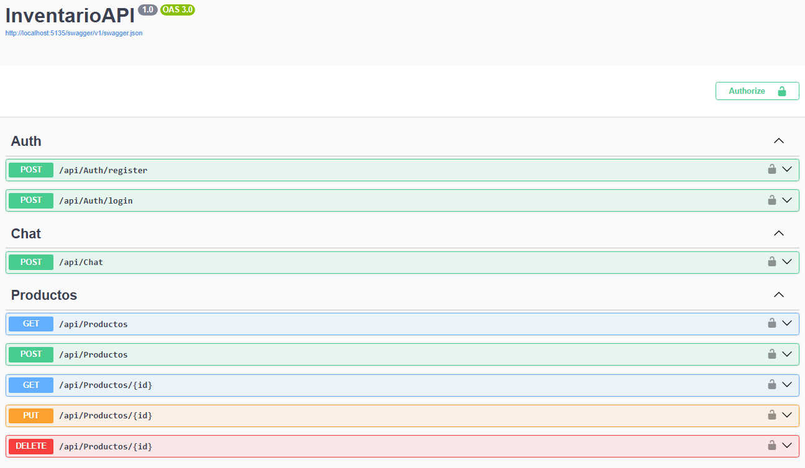
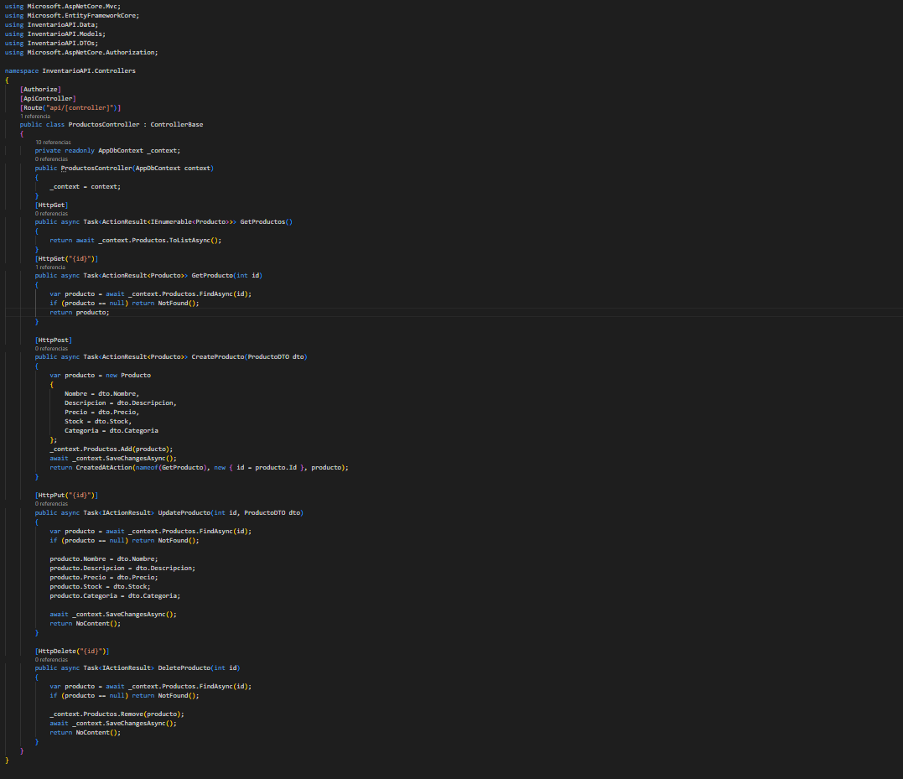
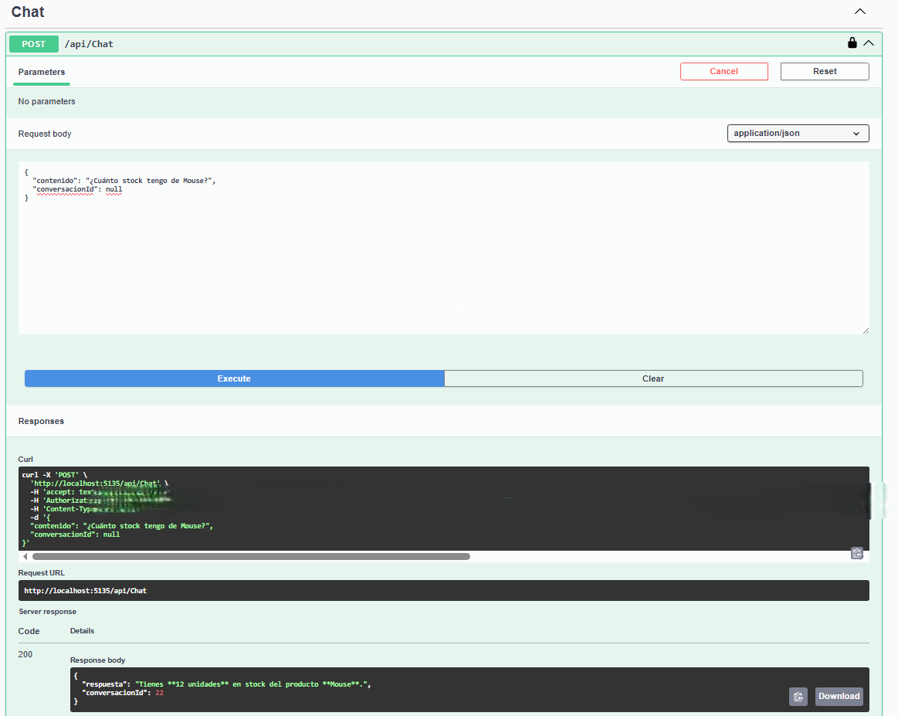

# InventarioAPI

REST API para gestión de inventario desarrollada con ASP.NET Core (.NET 9), Entity Framework Core y autenticación JWT.

Incluye un **chatbot con IA (Google Gemini)** que permite consultar el stock en lenguaje natural, usando *function calling* para conectar las respuestas del modelo con los datos reales de la base.

## 🚀 Funcionalidades

- CRUD completo de productos, protegido con autenticación JWT.
- Registro y login de usuarios.
- **Chatbot inteligente** (`/api/Chat`): el usuario pregunta en lenguaje natural (ej: *"¿Cuánto stock tengo de Mouse?"*) y la API responde con el dato real de stock, consultado directamente en la base de datos a través de function calling con Gemini.

## 🛠️ Tecnologías

- ASP.NET Core .NET 9
- Entity Framework Core
- SQL Server
- JWT Bearer Authentication
- Google Gemini API (function calling)
- Swagger / OpenAPI

## 📌 Endpoints

### Auth
| Método | Ruta | Descripción |
|--------|------|-------------|
| POST | /api/auth/register | Registrar usuario |
| POST | /api/auth/login | Obtener token JWT |

### Productos (requieren token)
| Método | Ruta | Descripción |
|--------|------|-------------|
| GET | /api/productos | Listar productos |
| GET | /api/productos/{id} | Obtener producto |
| POST | /api/productos | Crear producto |
| PUT | /api/productos/{id} | Actualizar producto |
| DELETE | /api/productos/{id} | Eliminar producto |

### Chat con IA (requiere token)
| Método | Ruta | Descripción |
|--------|------|-------------|
| POST | /api/Chat | Consulta el stock en lenguaje natural |

**Ejemplo de request:**
```json
POST /api/Chat
{
  "contenido": "¿Cuánto stock tengo de Mouse?",
  "conversacionId": null
}
```

**Ejemplo de respuesta:**
```json
{
  "respuesta": "Tienes **12 unidades** en stock del producto **Mouse**.",
  "conversacionId": 22
}
```

**¿Cómo funciona por dentro?**
1. El mensaje del usuario se envía a Gemini junto con la definición de una función (`ConsultarStock`).
2. Gemini decide si necesita ese dato y devuelve un `functionCall` con el nombre del producto.
3. La API ejecuta `ConsultarStock` contra la base de datos real.
4. El resultado se reenvía a Gemini, que redacta la respuesta final en lenguaje natural.

## 📷 Capturas







## ▶️ Cómo correrlo localmente

**1. Cloná el repositorio:**
```bash
git clone https://github.com/lucasaguilera006-ai/inventario-api
cd inventario-api
dotnet restore
dotnet ef database update
dotnet run
```

Swagger disponible en `http://localhost:5135/swagger`

**2. Registrar usuario**
```json
POST /api/auth/register
{
  "username": "lucas",
  "password": "tuPassword"
}
```

**3. Obtener token**
```json
POST /api/auth/login
{
  "username": "lucas",
  "password": "tuPassword"
}
// Respuesta: { "token": "eyJ..." }
```

**4. Usar el token en cada request**
```
Authorization: Bearer eyJ...
```

## 📄 Licencia

Este proyecto fue desarrollado como muestra de portfolio.