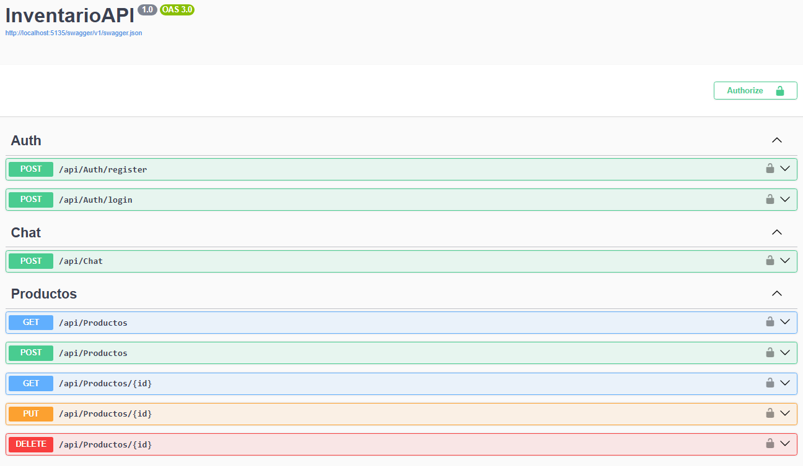
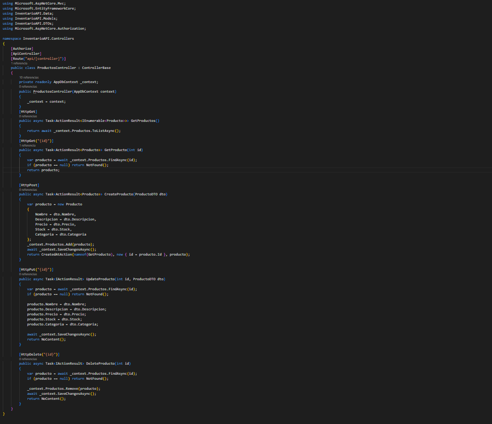
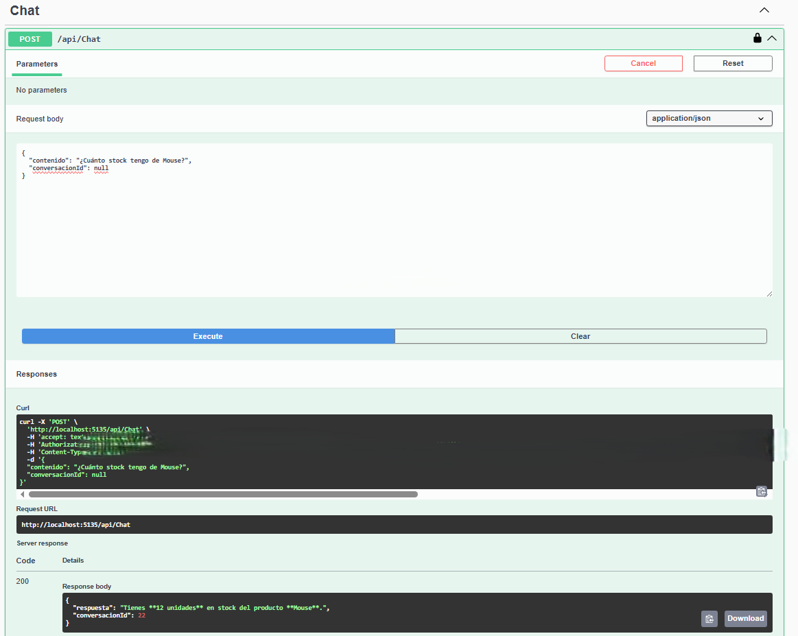

# InventarioAPI

REST API for inventory management built with ASP.NET Core (.NET 9), Entity Framework Core and JWT authentication.

It includes an **AI chatbot (Google Gemini)** that answers stock questions in natural language, using *function calling* to connect the model's answers to the real data in the database.

🔗 More projects in my portfolio: [Contra](https://contra.com/lucas_aguilera_6fn7g69r)

## 🚀 Features

- Full product CRUD, protected with JWT authentication.
- User registration and login.
- **AI chatbot** (`/api/Chat`): users ask in natural language (e.g. *"How many Mouse units do I have in stock?"*) and the API answers with the real stock figure, queried from the database through Gemini function calling.
- **Conversation history**: each user can list and read their own conversations. Nobody can access another user's.

## 🛠️ Tech stack

- ASP.NET Core (.NET 9)
- Entity Framework Core
- SQL Server
- JWT Bearer Authentication
- Google Gemini API (function calling)
- Swagger / OpenAPI

## 📌 Endpoints

### Auth
| Method | Route | Description |
|--------|-------|-------------|
| POST | /api/auth/register | Register a user |
| POST | /api/auth/login | Get a JWT token |

### Products (token required)
| Method | Route | Description |
|--------|-------|-------------|
| GET | /api/products | List products |
| GET | /api/products/{id} | Get a product |
| POST | /api/products | Create a product |
| PUT | /api/products/{id} | Update a product |
| DELETE | /api/products/{id} | Delete a product |

### AI chat (token required)
| Method | Route | Description |
|--------|-------|-------------|
| POST | /api/Chat | Ask about stock in natural language |
| GET | /api/Chat | List your conversations |
| GET | /api/Chat/{id} | Get a conversation with all its messages |

**Request example:**
```json
POST /api/Chat
{
  "content": "How many Mouse units do I have in stock?",
  "conversationId": null
}
```

**Response example:**
```json
{
  "reply": "You have **12 units** of **Mouse** in stock.",
  "conversationId": 22
}
```

Send `conversationId: null` to start a conversation, or reuse the returned id to continue it.

**How it works under the hood**
1. The user's message is sent to Gemini together with the definition of a stock-lookup function.
2. Gemini decides whether it needs that data and returns a `functionCall` with the product name.
3. The API runs the lookup against the real database and sends the result back to Gemini.
4. If Gemini needs another lookup (for example, with a different product name), the cycle repeats for up to 4 rounds.
5. Gemini writes the final answer in natural language.

> **Note:** the chat depends on the Gemini API. If the model is overloaded, the endpoint returns 502 (service error) or 504 (timeout). Retrying later or changing `Gemini:Model` usually fixes it.

## 📷 Screenshots







## ▶️ Running locally

**Requirements:** .NET 9 SDK and SQL Server.

**1. Clone the repository:**
```bash
git clone https://github.com/lucasaguilera006-ai/inventario-api
cd inventario-api
dotnet restore
```

**2. Set the SQL Server connection string** in `appsettings.json`.

**3. Configure Gemini** (the key never goes in the repo):
```bash
dotnet user-secrets set "Gemini:ApiKey" "YOUR_API_KEY"
dotnet user-secrets set "Gemini:Model" "gemini-3.8-flash"
```
You can get an API key in Google AI Studio.

**4. Create the database and run:**
```bash
dotnet ef database update
dotnet run
```

Swagger is available at `http://localhost:5135/swagger`.

**5. Register a user**
```json
POST /api/auth/register
{
  "username": "lucas",
  "password": "yourPassword"
}
```

**6. Get a token**
```json
POST /api/auth/login
{
  "username": "lucas",
  "password": "yourPassword"
}
// Response: { "token": "eyJ..." }
```

**7. Use the token on every request**
```
Authorization: Bearer eyJ...
```

## 📄 License

This project was developed as a portfolio showcase.